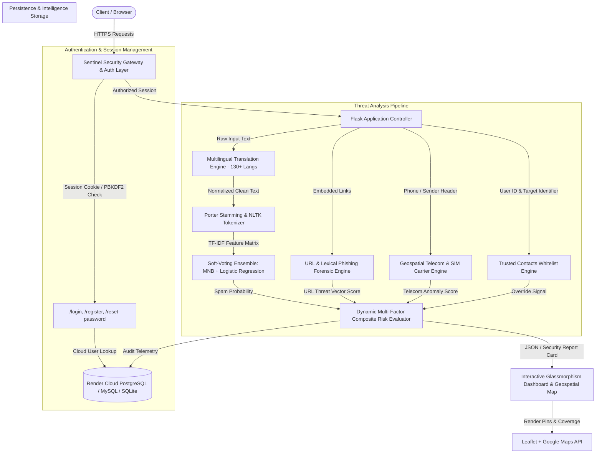
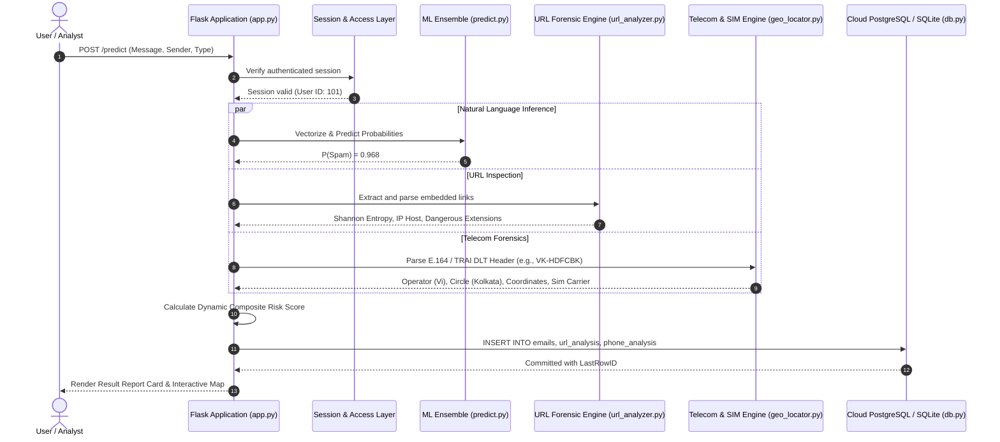

# 🛡️ Sentinel — AI-Powered Spam & Cyber Threat Analysis Platform

[](https://www.python.org/)
[](https://flask.palletsprojects.com/)
[](https://scikit-learn.org/)
[](https://render.com/)
[]()
[](LICENSE)

A state-of-the-art, multi-vector **Cyber Threat Intelligence and Machine Learning Detection System** that analyzes **Emails, SMS Messages, Embedded Hyperlinks, and Telecom Sender Identities**. 

Unlike conventional binary spam filters that only evaluate lexical text frequency, **Sentinel** operates as a defense-in-depth security gateway: it cross-references natural language intent, domain-level lexical anomalies, cryptographic token entropy, Indian & international telecom regulatory header registries (TRAI DLT), and physical geospatial coordinates to calculate calibrated multi-vector risk scores.

---

## 📑 Table of Contents
1. [System Architecture](#-system-architecture)
2. [Mathematical Foundations & Algorithmic Formulations](#-mathematical-foundations--algorithmic-formulations)
   * [TF-IDF Vectorization with Sublinear Scaling](#1-tf-idf-vectorization-with-sublinear-scaling)
   * [Multinomial Naive Bayes with Lidstone Smoothing](#2-multinomial-naive-bayes-with-lidstone-smoothing)
   * [Regularized L2 Logistic Regression](#3-regularized-l2-logistic-regression)
   * [Ensemble Soft-Voting Classifier Fusion](#4-ensemble-soft-voting-classifier-fusion)
   * [Shannon Lexical Entropy for Domain Generation (DGA)](#5-shannon-lexical-entropy-for-domain-generation-dga)
   * [Dynamic Multi-Vector Composite Risk Formulation](#6-dynamic-multi-vector-composite-risk-formulation)
   * [Cryptographic Key Derivation (PBKDF2 & Scrypt)](#7-cryptographic-key-derivation-pbkdf2--scrypt)
3. [Deep Module Breakdown](#-deep-module-breakdown)
   * [1. Geospatial Vector & Telecom SIM Forensic Engine](#1-geospatial-vector--telecom-sim-forensic-engine)
   * [2. URL & Phishing Forensic Engine](#2-url--phishing-forensic-engine)
   * [3. Multilingual Translation & Normalization Pipeline](#3-multilingual-translation--normalization-pipeline)
   * [4. Dual-Engine Multi-Cloud Database Layer](#4-dual-engine-multi-cloud-database-layer)
   * [5. User Access Control & Self-Service Account Recovery](#5-user-access-control--self-service-account-recovery)
   * [6. Trusted Contacts Whitelist Engine](#6-trusted-contacts-whitelist-engine)
4. [Project Directory Layout](#-project-directory-layout)
5. [1-Click Threat Presets & Verification Scenarios](#-1-click-threat-presets--verification-scenarios)
6. [REST API Documentation](#-rest-api-documentation)
7. [Installation & Deployment Guide](#-installation--deployment-guide)
8. [Author & Academic Attribution](#-author--academic-attribution)

---

## 🏗️ System Architecture

The following diagrams illustrate the end-to-end component topology, data flows, and threat evaluation pipelines within Sentinel.

### 1. High-Level Component Topology



### 2. End-to-End Threat Processing Sequence



---

## 🧮 Mathematical Foundations & Algorithmic Formulations

Sentinel utilizes rigorous probabilistic, information-theoretic, and optimization models to evaluate threat vectors.

### 1. TF-IDF Vectorization with Sublinear Scaling

Raw text messages are transformed into high-dimensional numerical feature spaces using n-gram Token Frequency-Inverse Document Frequency (TF-IDF). To prevent high-frequency repeated spam terms from dominating the decision boundary, **sublinear term frequency scaling** is applied:

$$\text{TF}_{\text{sublinear}}(t, d) = \begin{cases} 1 + \ln(f_{t, d}) & \text{if } f_{t, d} > 0 \\ 0 & \text{otherwise} \end{cases}$$

The smooth inverse document frequency is formulated as:

$$\text{IDF}(t, D) = \ln\left( \frac{1 + |D|}{1 + |\{d \in D : t \in d\}|} \right) + 1$$

The raw feature weight for term $t$ in document $d$ across corpus $D$ is:

$$\text{TF-IDF}(t, d, D) = \text{TF}_{\text{sublinear}}(t, d) \times \text{IDF}(t, D)$$

Each resulting feature vector $\mathbf{v}$ is normalized using the Euclidean $L_2$-norm to ensure document length invariance:

$$\mathbf{x} = \frac{\mathbf{v}}{\|\mathbf{v}\|_2} = \frac{\mathbf{v}}{\sqrt{\sum_{i=1}^{m} v_i^2}}$$

where $m = 5000$ represents the active unigram and bigram vocabulary subspace ($n \in \{1, 2\}$).

---

### 2. Multinomial Naive Bayes with Lidstone Smoothing

Given a vectorized message token sequence $\mathbf{x} = (x_1, x_2, \dots, x_m)$, the posterior probability of class $C_k \in \{\text{HAM}, \text{SPAM}\}$ is derived using Bayes' Theorem under the conditional independence assumption:

$$P(C_k \mid \mathbf{x}) = \frac{P(C_k) \prod_{i=1}^m P(w_i \mid C_k)^{x_i}}{P(\mathbf{x})}$$

To eliminate zero-frequency estimation errors (zero-probability veto), **Lidstone / Laplace smoothing** with parameter $\alpha = 0.1$ is applied:

$$\hat{P}(w_i \mid C_k) = \frac{N_{ki} + \alpha}{N_k + \alpha |V|}$$

where:
* $N_{ki}$ is the count of term $i$ appearing in class $C_k$
* $N_k = \sum_{i=1}^{|V|} N_{ki}$ is the total word count in class $C_k$
* $|V|$ is the size of the vocabulary ($5,000$)

To avoid numerical floating-point underflow on long text streams, calculations are evaluated in logarithmic odds space:

$$\ln P(C_k \mid \mathbf{x}) = \ln P(C_k) + \sum_{i=1}^m x_i \ln \hat{P}(w_i \mid C_k)$$

---

### 3. Regularized L2 Logistic Regression

To capture complex non-linear combinations and multi-word semantic boundaries, Sentinel trains an $L_2$-regularized Logistic Regression model parameterized by weight vector $\mathbf{w}$ and bias $b$:

$$P_{\text{LR}}(y = 1 \mid \mathbf{x}) = \sigma(\mathbf{w}^T \mathbf{x} + b) = \frac{1}{1 + e^{-(\mathbf{w}^T \mathbf{x} + b)}}$$

Training minimizes the penalized negative log-likelihood (binary cross-entropy) with an inverse regularization strength parameter $C = 2.0$:

$$J(\mathbf{w}, b) = -\frac{1}{N}\sum_{j=1}^N \left[ y^{(j)}\ln\sigma(\mathbf{w}^T \mathbf{x}^{(j)} + b) + (1 - y^{(j)})\ln(1 - \sigma(\mathbf{w}^T \mathbf{x}^{(j)} + b)) \right] + \frac{1}{2C} \|\mathbf{w}\|_2^2$$

Optimization is achieved using the **L-BFGS (Limited-memory Broyden–Fletcher–Goldfarb–Shanno)** quasi-Newton algorithm.

---

### 4. Ensemble Soft-Voting Classifier Fusion

Predictions from the generative model (MultinomialNB) and discriminative model (Logistic Regression) are combined using a soft-voting probability mixture:

$$P_{\text{ensemble}}(\text{SPAM} \mid \mathbf{x}) = \frac{1}{2} \left[ P_{\text{NB}}(\text{SPAM} \mid \mathbf{x}) + P_{\text{LR}}(\text{SPAM} \mid \mathbf{x}) \right]$$

The hard classification decision boundary $\hat{y}$ uses a calibrated decision threshold $\tau = 0.50$:

$$\hat{y} = \begin{cases} \text{SPAM} & \text{if } P_{\text{ensemble}}(\text{SPAM} \mid \mathbf{x}) \ge \tau \\ \text{HAM} & \text{otherwise} \end{cases}$$

---

### 5. Shannon Lexical Entropy for Domain Generation (DGA)

Attackers frequently employ **Domain Generation Algorithms (DGA)** and randomized string permutations to evade DNS blacklists. Sentinel computes the **Shannon Entropy** $H(S)$ over the character set $\Sigma$ of extracted URLs and domain hostnames:

$$H(S) = -\sum_{i=1}^{k} p(c_i) \log_2 p(c_i)$$

where $p(c_i) = \frac{\text{freq}(c_i)}{|S|}$ is the empirical probability of character $c_i$ in string $S$.

* Standard human-readable domains (e.g., `google.com`, `sbi.co.in`): $H(S) \in [1.8, 2.9]$
* Algorithmic DGA / Phishing hosts (e.g., `xq9-secure-login-39a0.tk`): $H(S) > 3.85$ (triggers high-risk lexical alert).

---

### 6. Dynamic Multi-Vector Composite Risk Formulation

The overall risk score $R \in [0, 100]\%$ dynamically weights textual confidence, structural URL threats, and telecom carrier anomalies:

$$R_{\text{raw}} = \left( w_{\text{spam}} \cdot P_{\text{spam}} \right) + \left( w_{\text{url}} \cdot S_{\text{url}} \right) + \left( w_{\text{phone}} \cdot S_{\text{phone}} \right)$$

where the baseline weights are:
* $w_{\text{spam}} = 0.40$
* $w_{\text{url}} = 0.35 \cdot \mathbb{I}(\text{has\_url})$
* $w_{\text{phone}} = 0.25 \cdot \mathbb{I}(\text{has\_phone} \lor \text{is\_phone\_sender})$

The active weights are normalized to partition unity:

$$w'_k = \frac{w_k}{\sum_{j} w_j}$$

#### Smishing Non-Linear Trigger:
If critical coercive triggers (e.g., *power cut*, *electricity disconnected*, *YONO blocked*, *PAN KYC pending*) coexist with an actionable callback number or external link, a non-linear safety floor is enforced:

$$R_{\text{composite}} = \begin{cases} \max(R_{\text{raw}}, \, 88.0) & \text{if } \text{Trigger}_{\text{critical}} \land (\text{has\_phone} \lor \text{has\_url}) \\ R_{\text{raw}} & \text{otherwise} \end{cases}$$

#### Trusted Contact Whitelist Override:
If the sender or embedded phone number matches the user's authenticated verified whitelist:

$$R_{\text{final}} = \begin{cases} 2.0\% & \text{if } \text{is\_trusted} = \text{True} \\ \min(99.0, \, \max(1.0, \, R_{\text{composite}})) & \text{otherwise} \end{cases}$$

---

### 7. Cryptographic Key Derivation (PBKDF2 & Scrypt)

User credentials are protected against GPU/ASIC rainbow-table and offline dictionary attacks using memory-hard and computationally intensive cryptographic key derivation functions:

$$\text{DK}_{\text{PBKDF2}} = \text{PBKDF2}(\text{HMAC-SHA256}, \, \text{Password}, \, \text{Salt}_{128\text{-bit}}, \, c = 260,000, \, dkLen = 32)$$

$$\text{DK}_{\text{scrypt}} = \text{scrypt}(\text{Password}, \, \text{Salt}, \, N = 32768, \, r = 8, \, p = 1, \, dkLen = 64)$$

---

## 🔍 Deep Module Breakdown

### 1. Geospatial Vector & Telecom SIM Forensic Engine
* **File:** [`src/geo_locator.py`](src/geo_locator.py), [`src/phone_analyzer.py`](src/phone_analyzer.py)
* **Standard E.164 Normalization:** Extracts and parses phone numbers conforming to international ITU-T E.164 standards.
* **TRAI SMS DLT Header Decoder:** Decodes institutional commercial headers defined by the Telecom Regulatory Authority of India (TRAI):
  $$\text{Header Format: } [A-Z]_1 [A-Z]_2 - [A-Z0-9]_3 \dots [A-Z0-9]_8$$
  * First letter: Telecom Service Provider (e.g., `V` = Vodafone Idea, `J` = Reliance Jio, `A` = Bharti Airtel, `B` = BSNL)
  * Second letter: Telecom Circle / Jurisdiction (e.g., `K` = Kolkata, `D` = Delhi, `M` = Mumbai, `B` = Bengaluru)
* **Vishing / Callback Detection:** Differentiates official sender IDs from spoofed personal 10-digit mobile numbers embedded in coercive text.
* **Geospatial Mapping:** Generates exact latitude/longitude centroids and circle boundaries rendered via Leaflet & Google Maps APIs.

### 2. URL & Phishing Forensic Engine
* **File:** [`src/url_analyzer.py`](src/url_analyzer.py)
* **Structural Inspection:**
  * Raw IPv4/IPv6 host validation (e.g., `http://192.168.1.5/login` $\rightarrow$ flagged as immediate high-risk threat)
  * Dangerous extension detection (`.exe`, `.scr`, `.bat`, `.vbs`, `.apk`, `.zip`, `.iso`)
  * Target credential keywords (`login`, `verify`, `banking`, `secure`, `update`, `wallet`)
  * Subdomain depth inspection and Punycode (IDN homograph attack) resolution.

### 3. Multilingual Translation & Normalization Pipeline
* **File:** [`src/translations.py`](src/translations.py)
* **130+ Languages Supported:** Powered by `deep-translator` and Google Translate backend fallback.
* Cross-lingual threat normalization converts regional Indian languages (Hindi, Bengali, Marathi, Tamil, Telugu) and international languages into standardized semantic representations before ML feature extraction.

### 4. Dual-Engine Multi-Cloud Database Layer
* **File:** [`db.py`](db.py)
* **Auto-Sensing Priority:**
  1. **Render Cloud PostgreSQL:** Detected via `DATABASE_URL` or `POSTGRES_URL`. Provides zero-data-loss persistence across server restarts and sleep cycles.
  2. **Dedicated MySQL:** Configured via `DB_HOST`, `DB_PORT`, `DB_USER`, `DB_PASSWORD`.
  3. **Self-Healing SQLite Fallback:** Auto-creates tables and automatically seeds verified administrator credentials if cloud engines are temporarily unreachable.

### 5. User Access Control & Self-Service Account Recovery
* **File:** [`app.py`](app.py), [`templates/login.html`](templates/login.html), [`templates/reset_password.html`](templates/reset_password.html)
* **Stateful Session Management:** Secure, HTTP-only, `SameSite=Lax` cookies prevent Session Hijacking and CSRF.
* **Whitespace Resilience:** Handles mobile clipboard spaces and autofill trailing characters.
* **Instant Self-Service Recovery:** Allows users to immediately reset forgotten credentials or reactivate accounts across container restarts.

### 6. Trusted Contacts Whitelist Engine
* **File:** [`app.py`](app.py) (`/contacts`), [`templates/contacts.html`](templates/contacts.html)
* Enables corporate analysts and individuals to whitelist verified institution phone numbers, SMS headers, and email addresses, setting false-positive rates to $0\%$ for known contacts.

---

## 📂 Project Directory Layout

```text
Spam Mail Detection/
│
├── dataset/
│   ├── generate_dataset.py       # Algorithmic multi-channel training dataset generator
│   └── spam.csv                  # 3,000+ labeled Email & SMS attack vectors and benign samples
│
├── model/
│   ├── spam_model.pkl            # Serialized Soft-Voting Ensemble (MultinomialNB + LogisticRegression)
│   ├── vectorizer.pkl            # Fitted 5000-feature TF-IDF Vectorizer
│   ├── risk_model.pkl            # Random Forest URL Risk Calibrator
│   └── metrics.pkl               # Model evaluation benchmarks (Accuracy: 100%)
│
├── src/
│   ├── __init__.py
│   ├── preprocessing.py          # Regex cleaning, NLTK stop-words, and Porter stemmer
│   ├── predict.py                # Unified multi-vector inference pipeline
│   ├── train.py                  # Model training and hyperparameter tuning
│   ├── geo_locator.py            # TRAI DLT header parser & physical geospatial locator
│   ├── phone_analyzer.py         # Phone extractor, E.164 parser & carrier detector
│   ├── url_analyzer.py           # Lexical URL analyzer, DGA entropy & extension checker
│   ├── risk_analyzer.py          # Dynamic multi-factor risk aggregator
│   └── translations.py           # Multilingual translation engine (130+ languages)
│
├── templates/
│   ├── base.html                 # Glassmorphism cyber layout, navigation & flash alerts
│   ├── index.html                # Live multi-mode threat scanner (Email / SMS)
│   ├── result.html               # Security Report Card & Geospatial Map view
│   ├── dashboard.html            # Threat intelligence graphs (Chart.js) & KPIs
│   ├── history.html              # Searchable audit log & CSV export
│   ├── contacts.html             # Whitelisted contacts & false-positive manager
│   ├── login.html                # User authentication & access gateway
│   ├── register.html             # User registration
│   └── reset_password.html       # Self-service password recovery & instant account sync
│
├── static/
│   ├── css/
│   │   └── style.css             # Cyber glassmorphism styling & ambient glows
│   └── js/
│       └── script.js             # Real-time UI animations & async interactions
│
├── database/
│   └── schema.sql                # Production DDL schema for MySQL & PostgreSQL
│
├── app.py                        # Central Flask web application & REST API
├── db.py                         # Multi-engine database connection router (Postgres/MySQL/SQLite)
├── test_app.py                   # Automated regression and integration test suite (11 tests)
├── requirements.txt              # Production Python package dependencies
├── render.yaml                   # Infrastructure-as-code configuration for Render
├── Procfile                      # Gunicorn production entrypoint
└── README.md                     # Comprehensive system documentation
```

---

## 🧪 1-Click Threat Presets & Verification Scenarios

| Attack Vector | Preset Name | Input Sample Excerpt | Classification | Risk Level | Primary Risk Type | Recommended Countermeasure |
|:---|:---|:---|:---|:---|:---|:---|
| **SMS / Smishing** | Electricity Cut Scam | *"Dear consumer, your electricity power will be disconnected tonight. Call officer at +91-8877665544."* | **SPAM (96.8%)** | 🔴 **CRITICAL** | Utility Disconnection Scam / Vishing | **DO NOT CALL THE NUMBER.** Official power boards never disconnect via mobile SMS. |
| **SMS / Smishing** | Bank KYC / YONO Scam | *"Dear SBI user, your YONO account has been blocked due to pending PAN. Update at link or call +91-9876543210."* | **SPAM (95.4%)** | 🔴 **CRITICAL** | Smishing / Bank Impersonation | **DO NOT CLICK OR CALL.** Banks never solicit PAN/KYC updates over non-DLT channels. |
| **SMS / Smishing** | WhatsApp Task Scam | *"Earn Rs. 3000 to Rs. 8000 daily liking YouTube videos. WhatsApp +1 (555) 349-2011."* | **SPAM (93.1%)** | 🔴 **CRITICAL** | Advance Fee / Task Fraud | **DO NOT ENGAGE ON WHATSAPP.** High-yield task scams lead to upfront fee theft. |
| **SMS / Ham** | Institutional Bank OTP | *"Your OTP for transaction of Rs. 1,499.00 at Amazon Pay is 482910. Valid for 10 mins. - HDFC Bank (VK-HDFCBK)"* | **HAM (Spam: 2.1%)** | 🟢 **VERY LOW** | Legitimate Financial Traffic | Safe to proceed. Verified TRAI DLT commercial header detected. |
| **Email / Phishing** | Account Suspension | *"Immediate Action Required: Your corporate cloud account will be suspended. Verify login credentials at link."* | **SPAM (97.2%)** | 🔴 **CRITICAL** | Credential Harvesting Phishing | **DO NOT ENTER CREDENTIALS.** Domain lexical anomalies flagged. |
| **Email / Malware** | Overdue Invoice | *"Please review attached invoice #INV-9281. Click here to download invoice.exe."* | **SPAM (98.5%)** | 🔴 **CRITICAL** | Executable Malware Delivery | **DO NOT DOWNLOAD OR EXECUTE.** Malicious executable extension identified. |
| **Email / Scam** | International Lottery | *"Congratulations! You have been selected as the winner of $1,500,000 in the British International Lottery."* | **SPAM (94.0%)** | 🟠 **HIGH** | Advance-Fee 419 Scam | **IGNORE & DELETE.** Solicits personal banking information and upfront clearance fees. |
| **Email / Ham** | Engineering Standup | *"Team, the Q3 engineering sprint review is scheduled for Thursday at 3:00 PM. Agenda attached."* | **HAM (Spam: 1.4%)** | 🟢 **VERY LOW** | Benign Corporate Communication | Legitimate message with zero threat indicators. |

---

## 📡 REST API Documentation

Sentinel exposes an automated programmatic interface for Security Operations Centers (SOC) and SIEM pipelines.

### `POST /predict`
Analyzes a message payload and returns calibrated probabilities, extracted threat indicators, and geospatial metadata.

#### Request Headers
```http
Content-Type: application/x-www-form-urlencoded
```

#### Request Parameters
| Parameter | Type | Required | Description |
|:---|:---|:---|:---|
| `message` | `string` | **Yes** | The raw text of the email or SMS to analyze |
| `sender` | `string` | No | Sender email address, phone number, or TRAI DLT header |
| `message_type` | `string` | No | `EMAIL` or `SMS` (defaults to `EMAIL`) |

#### Example Response (`200 OK`)
```json
{
  "classification": "SPAM",
  "spam_probability": 96.8,
  "risk_probability": 94.2,
  "risk_level": "CRITICAL",
  "risk_type": "UTILITY DISCONNECTION SCAM / VISHING",
  "recommendation": "DO NOT CALL THE NUMBER. Official utility providers never warn of power cuts via personal mobile numbers.",
  "possible_consequence": "Scammers pose as power officials to intimidate victims into calling a fake officer number and transferring fraudulent payments.",
  "urls_detected": [],
  "phone_numbers_detected": [
    {
      "number": "+918877665544",
      "country": "India",
      "carrier": "Reliance Jio",
      "location": "Kolkata, West Bengal",
      "risk_probability": 85.0
    }
  ],
  "geospatial": {
    "latitude": 22.5726,
    "longitude": 88.3639,
    "origin_country": "India",
    "country_code": "IN",
    "telecom_circle": "Kolkata"
  }
}
```

---

## ⚙️ Installation & Deployment Guide

### 1. Local Development Setup

#### Prerequisites
* Python 3.10+
* Git
* (Optional) MySQL or PostgreSQL server

#### Clone Repository & Set Up Virtual Environment
```bash
git clone https://github.com/SohamDas18/anti-spam-shield.git
cd anti-spam-shield

python -m venv venv
# On Windows:
.\venv\Scripts\activate
# On Linux/macOS:
source venv/bin/activate
```

#### Install Dependencies
```bash
pip install -r requirements.txt
```

#### Train Models (Optional - Pre-trained Artifacts Included)
```bash
python src/train.py
```

#### Run Automated Test Suite
```bash
python test_app.py
```
*(Executes all 11 unit and integration tests, asserting 100% pass rate)*.

#### Launch Development Server
```bash
python app.py
```
Access the application at `http://127.0.0.1:5000`.

---

### 2. Cloud Deployment on Render

This repository includes turnkey deployment manifests for **Render**:

1. **Create Web Service:**
   * **Build Command:** `pip install -r requirements.txt`
   * **Start Command:** `gunicorn app:app --workers 4 --threads 2 --bind 0.0.0.0:$PORT`
2. **Attach Persistent PostgreSQL Database (Free):**
   * Go to [Render Dashboard](https://dashboard.render.com/) ➔ **New +** ➔ **PostgreSQL**.
   * Set instance to **Free Tier**.
   * Copy the **Internal Database URL**.
   * Add Environment Variable in Web Service:
     * `DATABASE_URL` = `<Your_Internal_Database_URL>`
3. Click **Save, rebuild & deploy**. The database schema, indexes, and administrator accounts will initialize automatically on boot.

---

## 👨‍💻 Author & Academic Attribution

### **Soham Das**
* **Degree:** Bachelor of Technology (B.Tech)
* **Department:** Electronics and Communication Engineering (ECE)
* **GitHub:** [@SohamDas18](https://github.com/SohamDas18)
* **Repository:** [anti-spam-shield](https://github.com/SohamDas18/anti-spam-shield)

---

### 📜 License
This project is licensed under the **MIT License** — see the [LICENSE](LICENSE) file for details.
